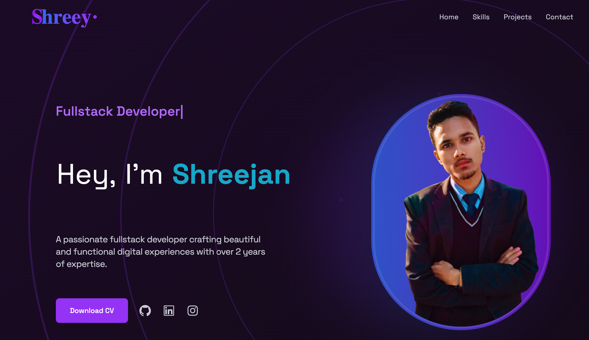

# 🚀 Shreejan's Portfolio Website

  

## ✨ Overview

A modern, responsive portfolio website showcasing my journey as a Full Stack Developer. Built with React and powered by a Node.js backend, featuring interactive animations, project showcases, and a clean, professional design.

## 🛠️ Built With

### Frontend

- **React 18** - Modern UI development
- **Tailwind CSS** - Styling and responsiveness
- **Framer Motion** - Smooth animations
- **Matter.js** - Physics-based text animations
- **React Type Animation** - Dynamic text effects

### Backend

- **Node.js** - Runtime environment
- **Express** - Web framework
- **MongoDB** - Database
- **Mongoose** - ODM

### Deployment

- **Vercel** - Frontend and Backend hosting
- **MongoDB Atlas** - Cloud database

## 🌟 Key Features

- 💫 Interactive UI with smooth animations
- 📱 Fully responsive design
- 🎨 Modern and clean aesthetic
- 💻 Project showcase with live demos:
  - Social Media Clone
  - Trendify E-Commerce Platform
  - E-Tea Nepal Multi-vendor Platform
  - Interactive Quiz App
- 📊 Dynamic skills visualization
- ❤️ Like system with MongoDB integration
- 📬 Contact form functionality

## 🔗 Featured Projects

1. **[Trendify - Fashion E-Commerce](https://trendify-frontend-dusky.vercel.app/)**

   - Full-stack Fashion clothing e-commerce solution
   - User authentication, payment processing, order management

2. **[E-Tea Nepal](https://e-tea-nepal.vercel.app/)**

   - Multi-vendor tea selling platform
   - Buyer, seller, and admin functionalities

3. **[Social Media Clone](https://socialmediaclone-one.vercel.app/)**

   - Facebook-like frontend implementation
   - Theme customization and responsive design

4. **[Quiz App](https://quizapp-pink-mu.vercel.app/)**
   - Interactive knowledge testing platform
   - Score tracking and result display

## 📱 Connect With Me

  

---

  
Made with ❤️ by Shreejan Bhattarai

  
© 2024 All Rights Reserved

